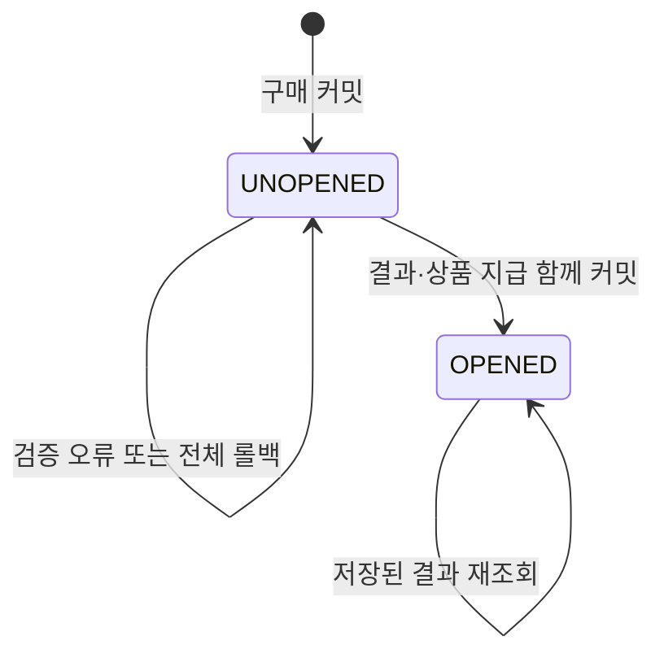

# 3단계: 구매 당시 확률 보존과 단일 개봉

## 구현 범위와 운영 제한

구매 시 확률·상품 스냅샷을 주문에 저장하고, 개봉 시 그 스냅샷만 사용한다. 서버 crypto.randomInt로 정수 구간을 선택하고 캡슐 상태, 결과 기록, 상품 보관함 지급을 한 트랜잭션에 커밋한다. 동일 캡슐의 중복 요청은 저장한 결과를 반환한다.

**현재 개발·테스트 전용이다.** production에서 개봉과 GP 구매는 활성화할 수 없다. 실제 판매에 적용할 유한 재고형/고정 확률형 정책, GP 출처별 배분, 관리자 승인·감사, 결제·환불, 실제 앱 연결은 남아 있다. 이번 개발 모델은 고정 확률형이며 상품별 실물 재고 소진에 따라 확률이 바뀌는 모델이 아니다. 기존 상대 가중치(weight)는 새 엔진에서 사용하지 않는다.

## 확률·상품 계약

| 필드 | 규칙 |
| --- | --- |
| GachaItem.probabilityPpm | 명시적 정수, 전체 합계 1,000,000 = 100%. 1은 0.0001% |
| Item.isPremium | 필수 boolean. 등급으로 추정하지 않음 |
| Item.conversionGP | 명시적 0 이상 정수. 상품 가치나 등급으로 임의 생성하지 않음 |
| probability_snapshot | schemaVersion=1, mode=FIXED_PPM, 상품별 ID·이름·이미지·등급·가치·분류·전환GP·확률 |
| probability_version | 정렬·정규화한 스냅샷의 SHA-256. JSONB 키 순서와 무관 |

미입력·합계 불일치·중복 상품·비정상 필드는 409로 거절한다. 기존 데이터는 새 필드가 null로 남아 있어 설정 없이 판매할 수 없다. 관리자가 설정을 승인하는 API는 아직 제공하지 않으며, 테스트는 격리 DB fixture로 설정한다. 제공 정책의 일반10%/프리미엄100% 전환은 별도 확정 정가 기준과 관리자 검증이 필요하다. 이번 단계는 저장된 전환 GP를 보존하며 포인트 전환을 실행하지 않는다.

구매 당시 포함된 상품은 order_prize_refs가 FK로 참조하여 물리 삭제를 막는다. 주문 스냅샷과 당첨 결과 UPDATE는 DB trigger로 차단한다. 관리자 DB 권한까지 차단하는 외부 감사 증명이나 사용자 검증형 추첨을 제공하는 것은 아니다.

## API

모든 경로는 Bearer JWT 필요. 기존 공통 응답의 data를 사용한다.

1. `GET /gachas/:id/odds`: unitPrice, currency, snapshot, version을 읽는다. UI는 확률·상품 정보와 분류별 전환 GP를 표시해야 한다.
2. `POST /orders/gp`: 이전 본문에 **expectedProbabilityVersion**(64자리 SHA-256)을 추가해야 한다. 서버 가격 또는 스냅샷이 바뀌면409. 재시도는 같은 요청 키와 원래 가격·버전을 사용한다. 구매 영수증에는 스냅샷·버전이 포함된다.
3. `POST /capsules/:uuid/open`: 별도 요청 키나 사용자 입력 결과 없이 캡슐 UUID 자체를 중복 방지 키로 사용한다. 최초/반복 모두201, capsuleId·inventoryItemId·probabilityVersion·prize·openedAt 반환.
4. `GET /capsules/:uuid/result`: 개봉 결과 복구. 타인/없는 캡슐404, 아직 개봉하지 않은 본인 캡슐409. 구매·개봉 플래그가 꺼져도 조회 가능.
5. `GET /capsules`: UNOPENED만 반환한다. 개봉 상품은 `/inventory`에 나타나며 상품 이름·이미지·분류·전환 GP는 개봉 결과 스냅샷을 사용한다. 이전 방식 획득 상품은 전환 분류/GP를 null로 반환한다.

개봉은 GP를 추가 차감하지 않으며 legacy draws를 생성하지 않는다. 따라서 주문 판매 수량이 개봉 때 중복 가산되지 않는다. 기존 draws 기반 랭킹에 새 개봉 결과가 표시되는 연동은 별도 작업이다.

## 상태와 장애 처리

잠금 순서는 사용자→캡슐이며 미래 환불도 이 순서를 공유해야 한다. 소유권 확인 후 상태를 읽고 이전 결과를 조회한다. 난수는 0~999,999의 균등 정수이며 누적 확률의 반열린 구간에 매핑한다. 저장 실패 시 상품 지급과 상태 변경 모두 롤백한다. 커밋되지 않은 시도의 난수까지 재사용하지는 않는다. 성공한 개봉은 재추첨하지 않는다.

스냅샷이 없는 이전 테스트 주문은 자동 백필하지 않고 개봉을409로 거절한다. 명시적 테스트 데이터 정리 또는 별도 이전 절차가 필요하다. 운영 주문을 임의 수정하지 않는다.

## 마이그레이션과 검증

`1789391000000-AddCapsuleOpening` 적용 후 새 서버를 실행한다. 기존 주문/보관함을 삭제하지 않는다. 확률 또는 개봉 이력이 있으면 down은 삭제 대신 실패한다.

단위/HTTP: 구간 경계, 정확한 합계, 필수 분류, 중복 상품, 버전 정규화, 인증·UUID 검증, 운영 차단.
PostgreSQL: 주문·지급 기존 회귀 검사와 함께 동시6회 개봉 단일 지급, 타인 접근, 상품 수정 후 스냅샷 보존, 상품 삭제 차단, DB 불변성, 결과 저장 실패 시 전체 롤백, 과거 주문 거절, 판매 수량 이중 집계 방지를 확인한다. 확정 실행 결과는 PR의 CI 기록을 기준으로 한다.

다음 구현은 앱의 확률 확인→주문→미개봉 보관함→개봉 결과 연결이다. 출시는 실제 인증·결제·환불과 확률 운영 정책을 완성한 뒤 진행한다.
