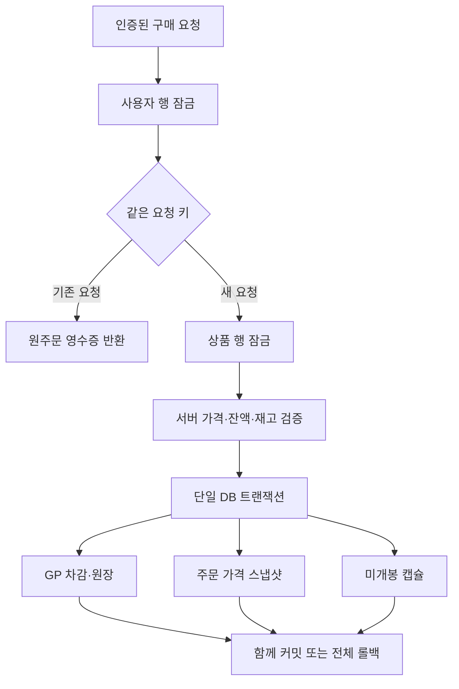

# 주문과 미개봉 캡슐: 2단계 구현

## 현재 범위

GP 전용 상품의 구매를 서버에서 처리하고 미개봉 캡슐을 별도 보관한다. 구매 시 당첨 상품을 생성하지 않는다. 현금 결제·개봉·환불은 이 API에 포함하지 않는다.

**개발/테스트 전용 기능**이다. `NODE_ENV=development|test`와 `ENABLE_GP_ORDER_PREVIEW=true`가 필요하며 `ENABLE_LEGACY_TRANSACTIONS=true`와 동시 활성화할 수 없다. production에서는 플래그와 관계없이 구매를 거절한다. 기존 GP 잔액의 출처·기한별 소비 배분, 확률 버전 및 지급 상품 스냅샷이 없으므로 실제 판매에 사용하지 않는다. 테스트 구매 캡슐은 실제 고객에게 이관하지 않는다.

## 구성



| 테이블 | 기록 | 제약 |
| --- | --- | --- |
| capsule_orders | 소유자, 요청 키, 상품, 가격·이름 스냅샷, 수량·합계, GP 차감 원장 ID, 당시 잔액 | 사용자+요청 키 유일, 원장 ID 유일, 양수 및 금액 일치 CHECK |
| owned_capsules | UUID, 주문 ID, 주문 내 순번, UNOPENED | 주문+순번 유일, 주문 FK RESTRICT |
| wallet_transactions | 음수 GP 차감, 구매 직후 잔액 | 기존 테이블 사용, 주문에서 FK 참조 |

기존 테이블은 삭제하거나 초기화하지 않는다. `1789390000000-AddCapsuleOrders` 마이그레이션 적용이 서버 배포보다 선행해야 한다. 주문 이력이 있으면 down은 삭제하지 않고 실패한다. 고객 탈퇴/익명화와 주문 보존 정책은 별도 설계가 필요하다.

## API 계약

모든 경로는 Bearer JWT 필요. 기존 공통 응답의 `data` 아래에 결과를 반환한다.

### POST /orders/gp

`Idempotency-Key`: 클라이언트가 논리적 구매마다 생성한 UUID v4. 통신 오류 재시도에는 반드시 **같은 키와 같은 본문**을 사용한다. 서버 성공 후 응답 유실에도 같은 주문/캡슐 ID를 복구한다. 같은 키에 다른 상품·수량·가격을 보내면 409이다. 다른 사용자의 같은 키는 별도 주문이다.

```json
{"gachaId": 7, "quantity": 2, "expectedUnitPrice": 100}
```

수량 1~100. `expectedUnitPrice`는 사용자에게 보여준 가격의 확인값이며 차감액은 DB 가격으로 계산한다. 가격이 다르면 409이고 차감하지 않는다. 현금/COIN 상품은 거절한다. 주문 합계는 기존 원장 integer 범위 안에서만 허용한다. bigint 잔액은 연산 시 BigInt로 다루고 기존 User 엔티티가 안전하게 표현할 수 없는 범위는 거절한다.

반환: orderId, gachaId, title, quantity, unitPrice, total, currency=GP, status=PAID, balanceAfter(문자열), createdAt, capsules 배열. balanceAfter는 원주문 당시 잔액이며 현재 잔액이 아니다. 첫 요청과 재시도 모두 HTTP 201. 잘못된 입력400, 소유자/판매 상품 없음404, 잔액·재고·가격·키 충돌409, 비활성503.

### GET /orders/:uuid

자신의 주문과 캡슐을 조회한다. 없는 주문과 타인 주문은 동일하게404. 구매 기능 비활성 상태에서도 읽기 가능.

### GET /capsules?page=1&limit=20

자신의 미개봉 캡슐을 최신순으로 반환한다. 최대100개/페이지. prize inventory(`/inventory`)와 별도이다. 페이지 이동 중 신규 구매에 따른 위치 변화는 있을 수 있다.

## 경쟁과 실패 처리

- 같은 사용자: 사용자 행 잠금 후 요청 키를 조회해 동시 재시도의 중복 차감 차단.
- 다른 사용자: 상품 행 잠금 후 주문 수량+기존 draw 수를 집계해 초과 판매 차단. 합성 판매 baseline은 제외한다. 과거 합성 draw 정리는 별도 필요.
- 잠금 순서는 사용자→상품이다. 후속 GP 변경 기능도 동일 사용자 행 잠금을 지켜야 한다.
- 원장/주문/캡슐 중 어느 기록이 실패해도 전부 롤백한다. 서버가 mutation을 자동 재시도하지 않는다.
- 새 구매 수량은 상품 상세의 soldStock에도 포함한다. 향후 캡슐 개봉을 기존 draws에 연결할 때 이중 집계하지 않도록 원주문 구분을 추가해야 한다.

## 검증

단위 테스트는 운영 활성화 차단, 플래그 조합, 입력 범위를 검사한다. HTTP 테스트는 실제 JWT·라우팅·ValidationPipe를 사용하고 구매 서비스는 대역이다. PostgreSQL 테스트는 실제 마이그레이션·원장·캡슐 지급, 동시 중복, 키 충돌, 소유권 조회, 가격 변경, 잔액/재고 경합, DB 지급 실패 시 전체 롤백과 재시도를 검증한다. 확정 결과는 PR의 CI 기록에 남긴다.

## 다음 단계와 출시 조건

1. 유한 재고형/고정 확률형 정책과 구매 또는 개봉 시점의 당첨 확정 정책을 확정하고 불변 확률 버전·일반/프리미엄·전환 GP 스냅샷 구현.
2. 별도 개봉 API에 서버 CSPRNG, 캡슐 소유권/상태 잠금, 결과 영속화·재조회 구현.
3. GP 출처별 잔액·사용 배분 및 취소 복구 모델 적용 후 현재 단일 잔액 모델 대체.
4. 다날 승인 조회와 원결제 취소 연동, 외부 승인 성공/내부 지급 실패 대사 구현.
5. 앱 구매 화면을 주문 영수증·미개봉 보관함에 연결하고 실제 인증·결제·개봉을 기기에서 검증.

이 단계는 Flutter 화면이나 출시 AAB를 변경하지 않는다. 기존 구매 버튼을 새 경로로 연결한 것으로 표시하지 않는다.
